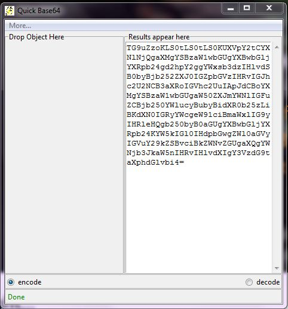

# Quick Base64
Can I get a star :star: - I would really appreciate it. :smile:
----------------------------------------------------

------------------------------------------------------

Before we get started, let us know what __Base64__ is first.

## What is Base64? 

According to Wikipedia,
> __Base64__ is a group of binary-to-text encoding schemes that represent binary data (more specifically a sequence of 8-bit bytes)
> in  an ASCII string format by translating it into a radix-64 representation. 

## Why do I need to encode in Base64?

* Encoding in base64 allows you to embed binaries in text.
* It ensures that data remains intact without modification during transport.
* Embedding base64 encoded images into your web page, makes the page load faster.
* Enables you to pass complex data over SSH.

  

## What is Quick Base64?

 is an application which encodes your text and files into base64 format.
Not only can it encode, it can also decode your base64 contents to it's original format. :dark_sunglasses:

As you can see from it's name, it's *Quick*, that's why it's named Quick Base64.

​														__Screenshot of the application__

The application has a minimalistic interface but has great features. The reason is to make it's use simple for normal encoding and decoding, whiles been able to become complex when the need arises.

You might be wondering, "Where is the start, encode or decode button?". The answer is, it has none. So then, how does it encode or decode. The answer is simple, everything is intialized when a file is dropped onto it's surface. 

### How it Works

On application start, the default mode is always set to encode, unless changed by the user.  The magic happens when a file or piece of text is dropped onto it's surface. When an object is dropped, it first's checks the mode to see if it is on encode or decode.

If mode is:
* Encode:

   ​	First of all, it checks to see if the object dropped was a file, folder or text. It displays an error if a folder is dropped.
   
   ​	The contents of the file is read and encoded into base64 format.
   
   ​	If the encoded data is greater than 20000 bytes, only the first 20000 bytes are displayed. Reason is that, if the data to be displayed is more than that, it causes the application to hang.
   
* Decode:

   ​	When an object is dropped, it checks to see if it is a file or folder. An error is raised if object is a folder.

   ​	If the object is a file, it's contents are read. It is then checked, if it is a valid base64 text.

   ​	If it is, it then decodes the base64 text. In order to know the file type of the decoded data. It uses the [file]('https://www.en.wikipedia.com/wiki/File_(command)') command to find the file 	type.

   ​	It first tries the command `file --extension temporary_file` , if it doesn't get the extension from this command. It tries to get the 

   ​	mime-type using the command `file --mime-type temporary_file` . An extension is then generated from the mime-type of the 	    	contents.

## Why use Quick Base64?

There are many base64 encoders out there. The reason why Quick Base64 is unique is that:
* It's simple to use.
* Can encode and decode base64 contents.

## Donation 

You can donate into my bitcoin account. 

